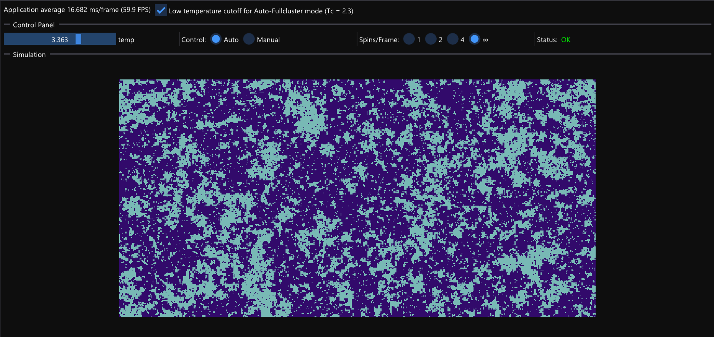

## Real time Wolff Cluster algorithm simulation of the 2D Ising Model 

Solving the 2D Ising Model is notoriously difficult. In the most "naive" Monte-Carlo approach, the Metropolis algorithm, one only consider single spin flips, which are accepted or rejected depending. As a result, lots of trials are needed to generate uncorrelated configurations.   The way out of this is to use **cluster algorithms**. 
The [Swendsen-Wang algorithm](https://github.com/so-groenen/swendsen_wang_ising) (Follow the link for some simulation result) generates multiple cluster per Monte-Carlo trial. 
The Wolff algorithm on the other hand generates single clusters by randomly picking a spin and growing a cluster by adding more spins.  

### Demo

### In this C++ project you can:

* Manually seed a magnetic cluster and see how the cluster grows by flipping neighboring spins
* See how temperature affects magnetic cluster growth
* Use the automatic mode to see how large these clusters can be
* See how temperature affects the size of the clusters

### Background

I started this project one year ago using Raylib. I completly reworked the project while learning about [ImGui](https://github.com/ocornut/imgui). Not much is left from the initial project as I didn't use back then... 
In the end, I created my own small C++ "interface" for ImGui, inspired by Rust egui, called [PhysGui](https://github.com/so-groenen/physgui). 

